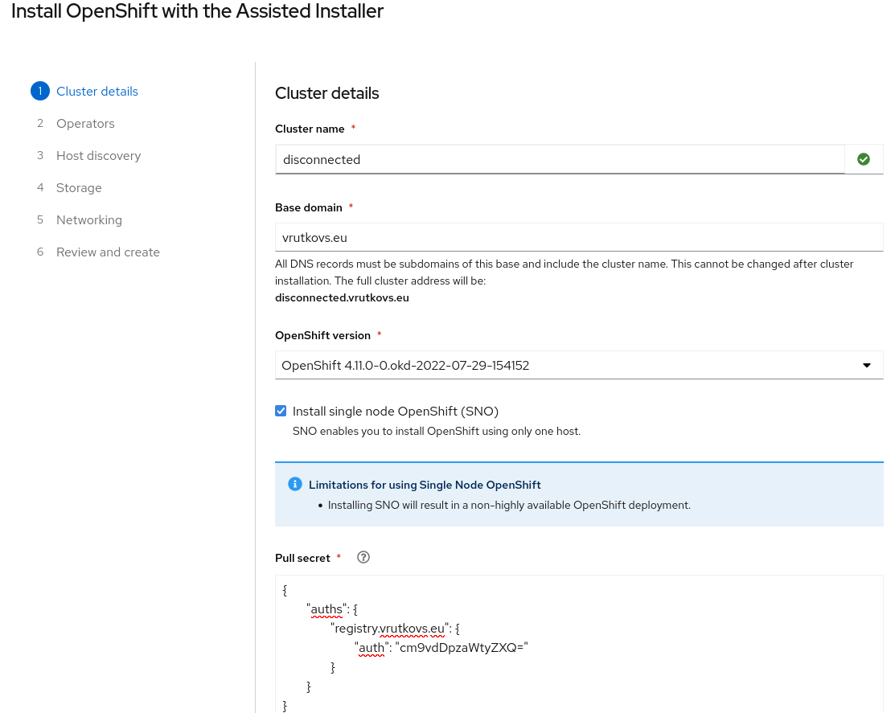
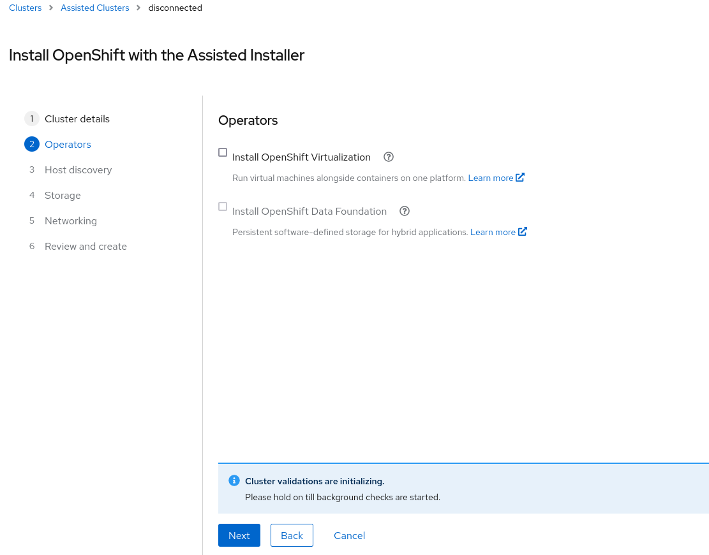
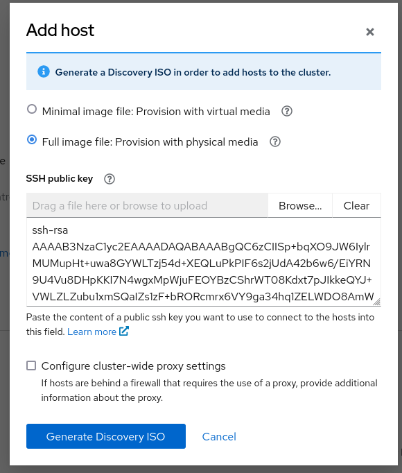
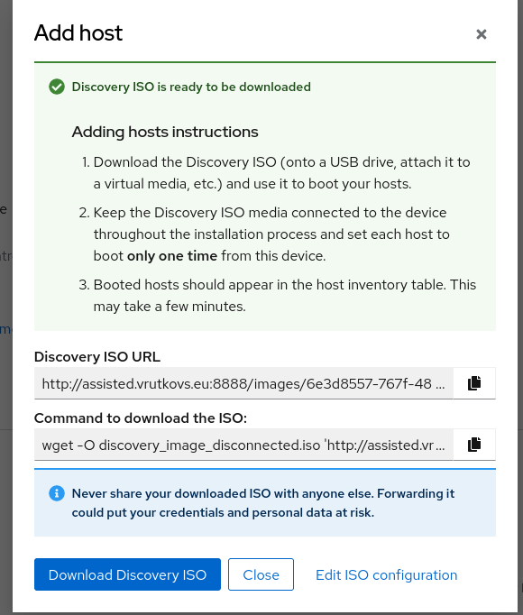
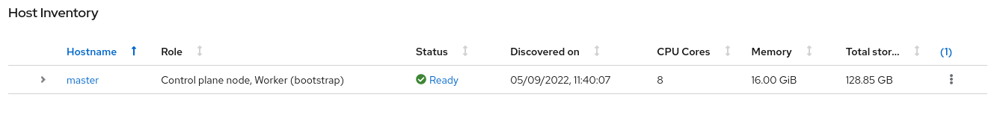
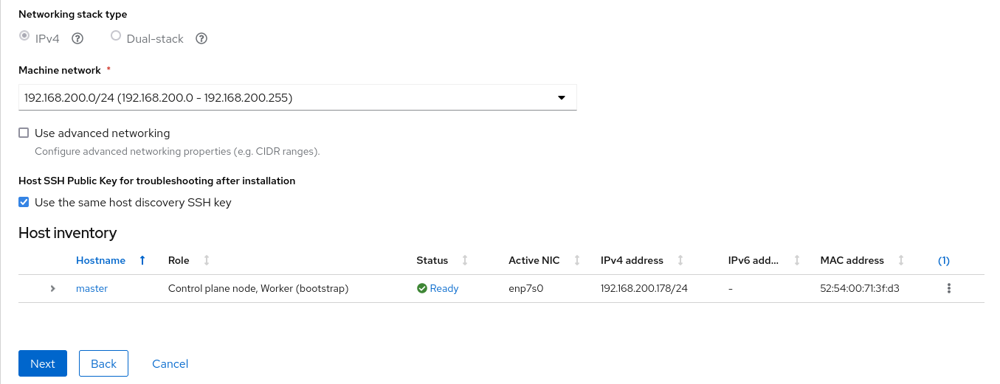
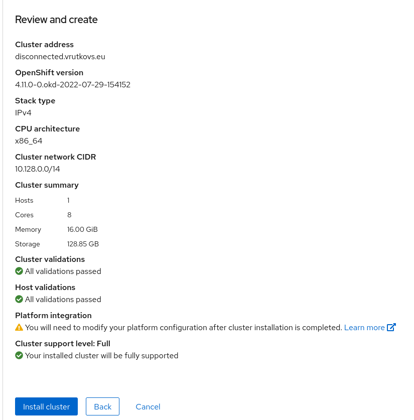
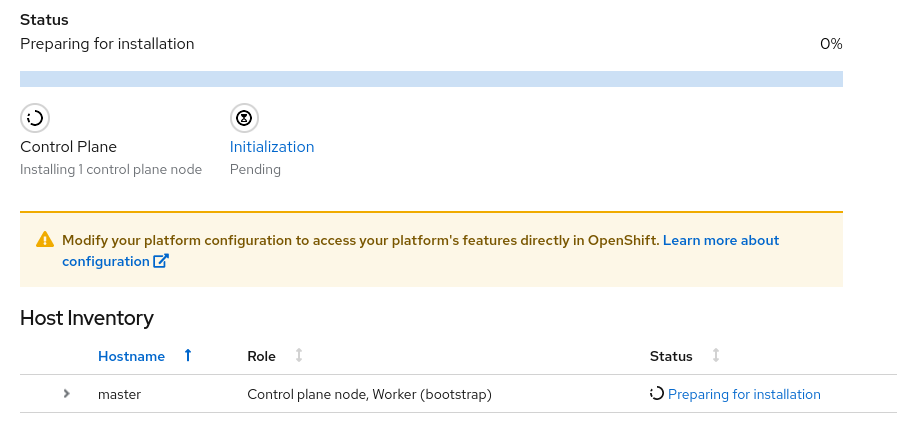
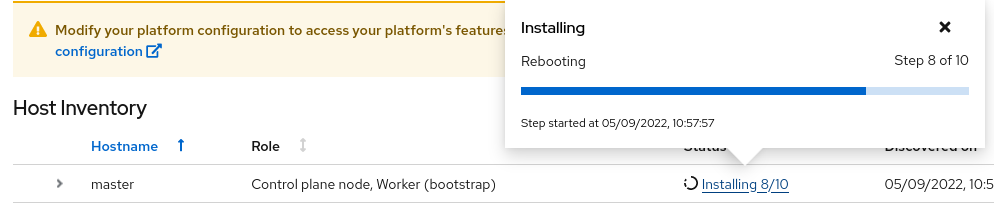
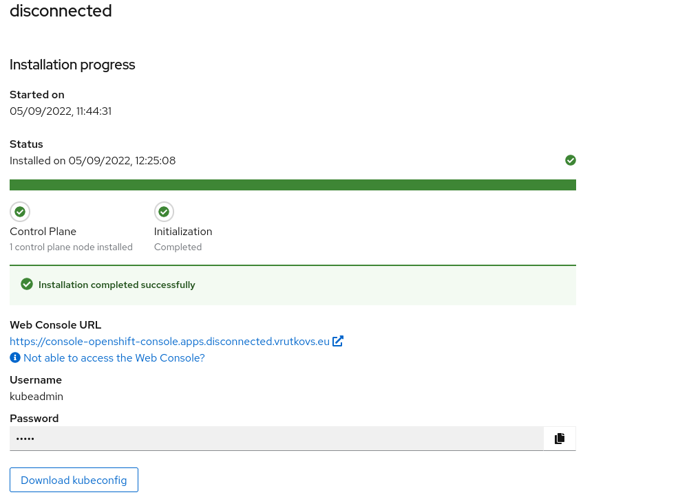

# Prepare certificates for registry

Use `openssl` to generate certificates or, simply, use LetsEncrypt wildcard cert:
```
mkdir /srv/registry/certs -p
cp -rvf /etc/letsencrypt/live/vrutkovs.eu/fullchain.pem /srv/registry/certs/domain.crt
cp -rvf /etc/letsencrypt/live/vrutkovs.eu/privkey.pem /srv/registry/certs/domain.key
```

## Generate authentication for local registry

Login: `root`
Password: `sikret`
```
mkdir /srv/registry/auth -p
podman run --rm --entrypoint htpasswd docker.io/registry:2.7.0 -Bbn root sikret > /srv/registry/auth/htpasswd
```

## Start a local registry

```
podman run -d \
  --restart=always \
  --name registry \
  -v /srv/registry/auth:/auth:z \
  -v /srv/registry/certs:/certs:z \
  -e REGISTRY_AUTH=htpasswd \
  -e REGISTRY_AUTH_HTPASSWD_REALM="Registry Realm" \
  -e REGISTRY_AUTH_HTPASSWD_PATH=/auth/htpasswd \
  -e REGISTRY_HTTP_ADDR=0.0.0.0:443 \
  -e REGISTRY_HTTP_TLS_CERTIFICATE=/certs/domain.crt \
  -e REGISTRY_HTTP_TLS_KEY=/certs/domain.key \
  -p 443:443 \
  docker.io/registry:2.7.0
podman login registry.vrutkovs.eu
```

## Mirror OKD release to the local registry

```
wget https://mirror.openshift.com/pub/openshift-v4/clients/ocp/stable-4.11/openshift-client-linux-4.11.1.tar.gz -O - | sudo tar -xz -C /usr/local/bin
oc adm release mirror quay.io/openshift/okd:4.11.0-0.okd-2022-07-29-154152 --to registry.vrutkovs.eu/okd-content --to-release-image=registry.vrutkovs.eu/okd:4.11.0-0.okd-2022-07-29-154152
```
Once mirroring is complete it would print the suggested addition to install-config:
```
imageContentSources:
- mirrors:
  - registry.vrutkovs.eu/okd-content
  - registry.vrutkovs.eu/okd
  source: quay.io/openshift/okd
- mirrors:
  - registry.vrutkovs.eu/okd-content
  - registry.vrutkovs.eu/okd
  source: quay.io/openshift/okd-content
```

## Mirror assisted images

```
dnf install -y skopeo
skopeo copy docker://quay.io/vrutkovs/okd-rpms:4.11 docker://registry.vrutkovs.eu/assisted/okd-rpms:4.11
skopeo copy docker://quay.io/centos7/postgresql-12-centos7:latest docker://registry.vrutkovs.eu/assisted/postgresql-12-centos7:latest
skopeo copy docker://quay.io/edge-infrastructure/assisted-installer-ui:latest docker://registry.vrutkovs.eu/assisted/assisted-installer-ui:latest
skopeo copy docker://quay.io/edge-infrastructure/assisted-image-service:latest docker://registry.vrutkovs.eu/assisted/assisted-image-service:latest
skopeo copy docker://quay.io/edge-infrastructure/assisted-service:latest docker://registry.vrutkovs.eu/assisted/assisted-service:latest
skopeo copy docker://quay.io/edge-infrastructure/assisted-installer-agent:latest docker://registry.vrutkovs.eu/assisted/assisted-installer-agent:latest
skopeo copy docker://quay.io/edge-infrastructure/assisted-installer:latest docker://registry.vrutkovs.eu/assisted/assisted-installer:latest
skopeo copy docker://quay.io/edge-infrastructure/assisted-installer-controller:latest docker://registry.vrutkovs.eu/assisted/assisted-installer-controller:latest
skopeo copy docker://quay.io/karmab/aicli docker://registry.vrutkovs.eu/assisted/aicli:latest
```

## Host local source of Fedora CoreOS images

```
mkdir /srv/registry/fcos
cd /srv/registry/fcos
wget https://builds.coreos.fedoraproject.org/prod/streams/stable/builds/36.20220716.3.1/x86_64/fedora-coreos-36.20220716.3.1-live.x86_64.iso
podman run -d \
  --name image-storage \
  -v /srv/registry/fcos:/data:z \
  -w /data \
  -p 3000:3000 \
  docker.io/python:latest python3 -m http.server 3000
```

## Pull secret

Our registry requires authentication, so we'll need to re-login to get a pullsecret:
```
podman login registry.vrutkovs.eu --authfile=/tmp/pullsecret.json
cat /tmp/pullsecret.json
```

## Run Assisted Installer in podman

Fetch configuration and pod definition:
```
mkdir /srv/assisted-service
cd /srv/assisted-service
wget -O disconnected-okd-configmap.yml https://github.com/openshift/assisted-service/raw/master/deploy/podman/okd-configmap.yml
wget -O disconnected-pod.yml https://github.com/openshift/assisted-service/raw/master/deploy/podman/pod.yml
```

These images are using `quay.io` and use `127.0.0.1` as address. Instead we want to use the local mirror and `assisted.vrutkovs.eu`:

```
sed -i 's;quay.io/edge-infrastructure;registry.vrutkovs.eu/assisted;g' disconnected-pod.yml
sed -i 's;quay.io/centos7;registry.vrutkovs.eu/assisted;g' disconnected-pod.yml
sed -i 's;127.0.0.1:8;assisted.vrutkovs.eu:8;g' disconnected-okd-configmap.yml
sed -i 's;https://builds.coreos.fedoraproject.org/prod/streams/stable/builds/36.20220716.3.1/x86_64;http://assisted.vrutkovs.eu:3000;g' disconnected-okd-configmap.yml
sed -i 's;quay.io/openshift;registry.vrutkovs.eu;g' disconnected-okd-configmap.yml
sed -i 's;quay.io/vrutkovs/okd-rpms;registry.vrutkovs.eu/assisted/okd-rpms;g' disconnected-okd-configmap.yml
```

The cluster's mirroring settings prevent mirroring by tags, so we need custom setting to use Assisted Installer controller image via digest

```
cat >> disconnected-okd-configmap.yml << EOF
  CONTROLLER_IMAGE: $(skopeo inspect docker://registry.vrutkovs.eu/assisted/assisted-installer-controller:latest --format "{{.Name}}@{{.Digest}}")
EOF
```

Once config and pod definition are updated for disconnected use, lets use podman to start Assisted Installer:
```
podman play kube --configmap okd-disconnected-configmap.yml disconnected-pod.yml
```

## OKD installation

Now we can start the installation, let's click "Create New Cluster" at `assisted.vrutkovs.eu:8080`:



On "Operators" screen we'll just click "Next" - no operators were mirrored:



At "Host discovery" stage usually, we'd generate the ISO and boot from it, but it would attempt to pull images from `quay.io`, so first, we need to patch these with mirroring configuration via Ignition override. This assisted installer option
is available via API only, so we'll use [aicli](https://github.com/karmab/aicli) to interact with it:
```
alias aicli='podman run --net host -it --rm -e AI_URL=assisted.vrutkovs.eu:8080 -v /tmp:/workdir registry.vrutkovs.eu/assisted/aicli:latest'
```

Before discovery ISO can be booted it needs to be amended with mirroring configuration:
```
cat > /tmp/install-override<<EOF
registry_url: registry.vrutkovs.eu:443
installconfig:
  imageContentSources:
  - mirrors:
    - registry.vrutkovs.eu/assisted
    source: quay.io/edge-infrastructure
  - mirrors:
    - registry.vrutkovs.eu/okd
    source: quay.io/openshift/okd
  - mirrors:
    - registry.vrutkovs.eu/okd-content
    source: quay.io/openshift/okd-content
EOF
```
OperatorHub images and samples were not mirrored so we'll a baseline capability set only:
```
cat >>/tmp/install-override<<EOF
  capabilities:
    baselineCapabilitySet: None
EOF
```
The installer also needs an SSH key to be able to ssh on the nodes:
```
cat >>/tmp/install-override<<EOF
ssh_public_key: |
  $(cat ~/.ssh/id_rsa.pub)
EOF
```

Now we can patch the infrastructure environment, telling assisted image service to have these changes ending up in the cluster:
```
aicli update cluster disconnected --paramfile /workdir/install-override
aicli update infraenv disconnected --paramfile /workdir/install-override
```
where `disconnected` is the cluster name.

Click 'Add Host' to configure discovery ISO (ssh key is already filled in by `aicli`):


"Generate Discovery ISO" button will show a link and suggested command to download discovery ISO:


Alternatively, you can use `aicli info iso disconnected` to get ISO URL. `aicli` can work with the API the same way as UI (see [docs](https://aicli.readthedocs.io/en/latest)), but in this tutorial, I'll be using UI for the sake of demonstration.

Now we can boot hosts with discovery ISO.

Wait for all nodes to register themselves:

and click "Next"

This is a bare-metal installation, so on "Storage" screen we proceed by clicking "Next".

Network details are autodetected from DHCP:


On the "Review and create" screen lets double-check all parameters:

and start the installation.

After Assisted Installer verifies that nodes can pull all necessary images it would run the installer, generate `bootstrap.ign`, and pass it to the bootstrap node. The node would apply Ignition without reboot, run `bootkube.service`, and other bootstrap tasks.
Now the node would run Machine Config Server so that other masters would be able to fetch master Ignition (if necessary), convert bootstrap node into master, and reboot.


The host would remain in "Rebooting" state until the assisted-installer controller would not be started as a pod and report the installation progress back to the


Now the host is installed and cluster installations proceeds. Once the ingress and console are running Assisted Installer UI would display the kubeadmin password and a link to the cluster console.


Once all operators have reported success the cluster installation is complete, and voila.
